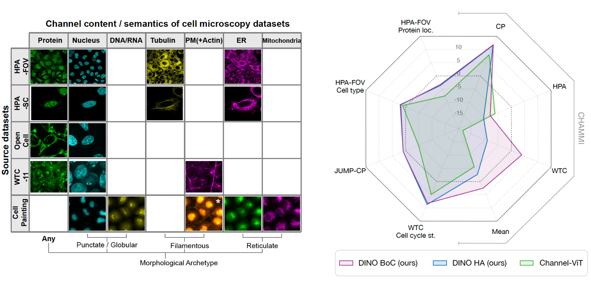

# Scaling Channel-Adaptive Self-Supervised Learning

 [[`Paper `](https://openreview.net/forum?id=pT8sgtRVAf))] [[`BibTeX`](#citing-channeladaptivedino-and-dinov2)]

**[Meta AI Research, FAIR](https://ai.facebook.com/research/)**

Alice V. De Lorenci, Seungeun Yi, Théo Moutakanni, Piotr Bojanowski, Camille Couprie, Juan C. Caicedo, Wolfgang M. Pernice,

with special thanks to Elouan Gardes for his contributions to the codebase. 

:warning: This is just the README, the code is coming soon (in July 2025).

PyTorch implementation and pretrained model for ChannelAdaptive-DINO. 

The contents of this repo, including the code and model weights, are intended for research use only. It is not for use in medical procedures, including any diagnostics, treatment, or curative applications. Do not use this model for any clinical purpose or as a substitute for professional medical judgement.



## Pretrained model

You can download the model weights trained on the Extended CHAMMI dataset (combination of five cell microscopy datasets with variable numbers of channels) on torchhub. 

## Installation

Follow instructions in the DINOv2 README. There are two additionnal dependencies to pandas and tifffile. 

## What is included / not included

This repository includes the Bag of Channel implementation, not the Hierarchical attention approach. 

## Data preparation

The CHAMMI dataset is available [here](https://github.com/chaudatascience/channel_adaptive_models).

The HPA-FoV dataset is available [here]() TODO!


:warning: To execute the commands provided in the next sections for training and evaluation, the `dinov2` package should be included in the Python module search path, i.e. simply prefix the command to run with `PYTHONPATH=.`.

## Training

### Fast setup: training ChannelAdaptive-DINO ViT-L/16 on HPA single cell dataset

Run Channel-Adaptive DINO training on 4 A100-80GB nodes (32 GPUs) in a SLURM cluster environment with submitit:

```shell
python dinov2/run/train/train.py \
    --nodes 4 \
    --config-file dinov2/configs/train/hpafov_vitl16_boc.yaml \
    --output-dir <PATH/TO/OUTPUT/DIR> \
    train.dataset_path=HPAFoV:split=LARGE_REPRODUCE:root=<PATH/TO/DATASET>:wildcard=SEPARATE_CHANNELS"
```

Training time is approximately 2 days.
The training code saves the weights of the teacher in the `eval` folder every 12500 iterations for evaluation.
This example only performs pretraining on the HPA-FoV dataset. 

## Evaluation

The training code regularly saves the teacher weights. In order to evaluate the model, run the following evaluation on a single node:

### Linear Evaluation on HPAFoV

```shell 
PYTHONPATH=.:dinov2/data python dinov2/run/eval/linear_celldino.py \
  --config-file dinov2/configs/eval/channeldino_ext_chammi.yaml \
  --pretrained-weights <PATH/TO/OUTPUT/DIR>/eval/training_359999/teacher_checkpoint.pth \
  --output-dir <PATH/TO/OUTPUT/DIR>/eval/training_359999/linear \
  --train-dataset HPAFoV:split=LARGE_REPRODUCE:mode=PROTEIN_LOCALIZATION:root=<PATH/TO/DATASET> \
  --val-dataset HPAFoV:split=SMALL_REPRODUCE:mode=PROTEIN_LOCALIZATION:root=<PATH/TO/DATASET> \
  --val-metric-type mean_per_class_multilabel_f1 \
  --loss-type binary_cross_entropy \
  --bag-of-channels \
  --crop-size 384 \
  --n-last-blocks 4 \
  --batch-size 32 \
  --epoch-length 145 \
  --epochs 30 \
  --avgpool \ 
```

### KNN classification on CHAMMI

```shell
./launcher_CHAMMI_knn_eval.sh WTC TASK_ONE ;
./launcher_CHAMMI_knn_eval.sh WTC TASK_TWO ;
./launcher_CHAMMI_knn_eval.sh HPA TASK_ONE ;
./launcher_CHAMMI_knn_eval.sh HPA TASK_TWO ;
./launcher_CHAMMI_knn_eval.sh HPA TASK_THREE ;
./launcher_CHAMMI_knn_eval.sh CP TASK_ONE ;
./launcher_CHAMMI_knn_eval.sh CP TASK_TWO ;
./launcher_CHAMMI_knn_eval.sh CP TASK_THREE ;
./launcher_CHAMMI_knn_eval.sh CP TASK_FOUR ;
```

### Linear classification on CHAMMI

```shell
./launcher_CHAMMI_eval.sh WTC TASK_ONE ;
./launcher_CHAMMI_eval.sh WTC TASK_TWO ;
./launcher_CHAMMI_eval.sh HPA TASK_ONE ;
./launcher_CHAMMI_eval.sh HPA TASK_TWO ;
./launcher_CHAMMI_eval.sh HPA TASK_THREE ;
./launcher_CHAMMI_eval.sh CP TASK_ONE ;
./launcher_CHAMMI_eval.sh CP TASK_TWO ;
./launcher_CHAMMI_eval.sh CP TASK_THREE ;
./launcher_CHAMMI_eval.sh CP TASK_FOUR ;
```

|        | WTC - Task 1 | WTC - Task 2 | HPA - Task 1 | HPA - Task 2 | HPA - Task 3 | CP - Task 1 | CP - Task 2 | CP - Task 3 | CP - Task 4 |
| ---    | ---          | ---          | ---          | ---          | ---          | ---         | ---         | ---         | --- |
| knn reproduced  | 80.3 |  79.3 | 91.6 | 61.4 | 28.5 | 89.8 | 57.6 | 23.4 | 18.4 |
| knn paper  | 79.4 |  79.0 | 86.6 | 59.3 | 29.6 | 92.6 | 57.6 | 22.1 | 18.5 |
| Linear reproduced | 89.9 | 87.9  | 92.7 | 87.2 | 66.2 | 89.9 | 59.8 | 26.6 | 32.5|
| Linear paper | 90.5 |  89.2 | 88.3 | 84.7 | 65.0 | 90.5 | 60.5 | 25.8 | 32.7|


## License

CellDINO code is released under the CC by NC licence See [LICENSE_CELL_DINO](LICENSE_CELL_DINO) for additional details.
Model weights will be released under the FAIR Non-Commercial Research License.


## Citing ChannelAdaptiveDINO and DINOv2

If you find this repository useful, please consider giving a star :star: and citation :t-rex::

```
@misc{Delorenci2025scaling,
  title={Scaling Channel-Adaptive Self-Supervised Learning},
  author={V. De Lorenci, Alice and Yi, Seungeun and Moutakanni, Theo and Bojanowski, Piotr and Couprie, Camille and Caicedo, Juan C. and  Pernice, Wolfgang M.},
  journal={TMLR},
  year={2025}
}
```

```
@misc{oquab2023dinov2,
  title={DINOv2: Learning Robust Visual Features without Supervision},
  author={Oquab, Maxime and Darcet, Timothée and Moutakanni, Theo and Vo, Huy V. and Szafraniec, Marc and Khalidov, Vasil and Fernandez, Pierre and Haziza, Daniel and Massa, Francisco and El-Nouby, Alaaeldin and Howes, Russell and Huang, Po-Yao and Xu, Hu and Sharma, Vasu and Li, Shang-Wen and Galuba, Wojciech and Rabbat, Mike and Assran, Mido and Ballas, Nicolas and Synnaeve, Gabriel and Misra, Ishan and Jegou, Herve and Mairal, Julien and Labatut, Patrick and Joulin, Armand and Bojanowski, Piotr},
  journal={arXiv:2304.07193},
  year={2023}
}
```


